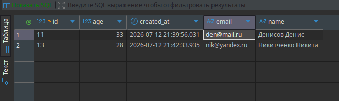
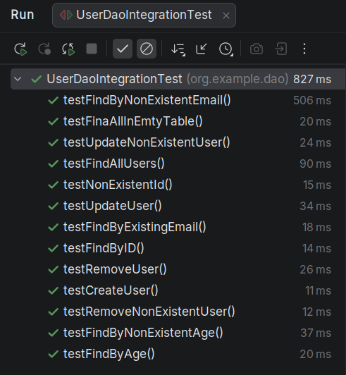
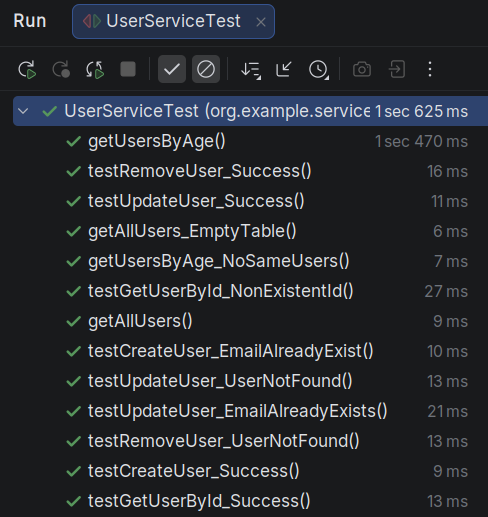

# Содержание 
- [Домашнее задание 2](#домашнее-задание-2)
- [Домашнее задание 3](#домашнее-задание-3)
- - -
# Домашнее задание 2.
### Разработать консольное приложение(user-service) на Java, использующее Hibernate для взаимодействия с PostgreSQL, без использования Spring.
### Приложение должно поддерживать базовые операции CRUD (Create, Read, Update, Delete) над сущностью org.example.entity.User.
### Требования:
- Использовать Hibernate в качестве ORM.
- База данных — PostgreSQL.
- Настроить Hibernate без Spring, используя hibernate.cfg.xml или properties-файл.
- Реализовать CRUD-операции для сущности org.example.entity.User (создание, чтение, обновление, удаление), которая состоит из полей: id, name, email, age, created_at.
- Использовать консольный интерфейс для взаимодействия с пользователем.
- Использовать Maven для управления зависимостями.
- Настроить логирование.
- Настроить транзакционность для операций с базой данных.
- Использовать DAO-паттерн для отделения логики работы с БД.
- Обработать возможные исключения, связанные с Hibernate и PostgreSQL.
- - - 

| №  | Требование                                                                                                                                                                                                                                                                                                                                                                                                                                                                                                                              | Стастус | Описание                                                                                                                                                                                                                                                                                           |
|:--:|:----------------------------------------------------------------------------------------------------------------------------------------------------------------------------------------------------------------------------------------------------------------------------------------------------------------------------------------------------------------------------------------------------------------------------------------------------------------------------------------------------------------------------------------|:-------:|:---------------------------------------------------------------------------------------------------------------------------------------------------------------------------------------------------------------------------------------------------------------------------------------------------|
| 1  | Использовать Hibernate в качестве ORM.                                                                                                                                                                                                                                                                                                                                                                                                                                                                                                  |    +    | В pom.xml добавлена соответствующая зависимость `hibernate-core`;<br/> В org.example.entity.User.java для сущности используются соответствующие анотации `@Entity, @Table, @Column...`;<br/> Конфигурация подтягивается из `hibernate.cfg.xml`.                                                                       |
| 2  | База данных — PostgreSQL.                                                                                                                                                                                                                                                                                                                                                                                                                                                                                                               |    +    | В pom.xml добавлена зависимость `postgresql`;<br/> БД развернута в docker-контейнере;<br/> В `hibernate.cfg.xml` указан драйвер, URL, логин, пароль.                                                                                                                                               |
| 3  | Настроить Hibernate без Spring, используя hibernate.cfg.xml или properties-файл.                                                                                                                                                                                                                                                                                                                                                                                                                                                        |    +    | `src/main/resources/hibernate.cfg.xml` настроен. Указаны драйвер, логин, пароль, URL, маппинг, SQL-формат.                                                                                                                                                                                         |
| 4  | Реализовать CRUD-операции для сущности org.example.entity.User (создание, чтение, обновление, удаление), которая состоит из полей: id, name, email, age, created_at.                                                                                                                                                                                                                                                                                                                                                                                       |    +    | Класс `src/main/java/org.example.entity.User.java` описывает требуемую сущность org.example.entity.User.                                                                                                                                                                                                                                 |
| 5  | Использовать консольный интерфейс для взаимодействия с пользователем.                                                                                                                                                                                                                                                                                                                                                                                                                                                                   |    +    | Взаимодействие с пользователем осуществляется через консоль. Взаимодействие описано в классе `src/main/java/Main.java`.                                                                                                                                                                            |
| 6  | Использовать Maven для управления зависимостями.                                                                                                                                                                                                                                                                                                                                                                                                                                                                                        |    +    | Проект использует Maven в качестве системы сборки. Все зависимости описаны в `pom.xml`.                                                                                                                                                                                                            |
| 7  | Настроить логирование.                                                                                                                                                                                                                                                                                                                                                                                                                                                                                                                  |    +    | В качестве логгера используется `logback`.<br/> Соответсвующая зависимость в pom.xml - `logback-classic`.<br/> Конфигурационный файл - `src/main/resources/logback.xml`.<br/> Реальный файл с логами не отслеживается в git, поэтому в качестве файла с логами представлен `logs/log_example.log`. |
| 8  | Настроить транзакционность для операций с базой данных.                                                                                                                                                                                                                                                                                                                                                                                                                                                                                 |    +    | Все операции чтения, изменения записей в БД осуществляются через транзакции.<br/> Используемые методы: `session.beginTransaction()`, `tr.commit()`, `tr.rollback()`.                                                                                                                               |
| 9  | Использовать DAO-паттерн для отделения логики работы с БД.                                                                                                                                                                                                                                                                                                                                                                                                                                                                              |    +    | Класс `src/main/java/org.example.dao.UserDao.java` описан в соответствии паттерну DAO. Все транзакции осуществляются через него.                                                                                                                                                                                   |
| 10 | Обработать возможные исключения, связанные с Hibernate и PostgreSQL.                                                                                                                                                                                                                                                                                                                                                                                                                                                                    |    +    | Все методы org.example.dao.UserDao.java обернуты в try-catch и try-with-resources.<br/> Исключения логируются через `log.error()`.                                                                                                                                                                                 |

- - - 
### Демонстрация работы программы
#### Консоль:
```
======================================
Chose operation:
1. Find all Users
2. Find org.example.entity.User by ID
3. Find Users by age
4. Create org.example.entity.User
5. Update org.example.entity.User
6. Remove org.example.entity.User
7. Exit
Your choice: 
4
Creating org.example.entity.User...
name: Никитченко Никита
email: nik@yandex.ru
age: 
28
======================================
Chose operation:
1. Find all Users
2. Find org.example.entity.User by ID
3. Find Users by age
4. Create org.example.entity.User
5. Update org.example.entity.User
6. Remove org.example.entity.User
7. Exit
Your choice: 
1
Finding all Users...
[/11, Денисов Денис, den@mail.ru, 33, 2026-07-12T21:39:56.031898/, /12, Васильев Василий, vasvas@gmail.com, 24, 2026-07-12T21:40:38.942445/, /13, Никитченко Никита, nik@yandex.ru, 28, 2026-07-12T21:42:33.935578/]
======================================
Chose operation:
1. Find all Users
2. Find org.example.entity.User by ID
3. Find Users by age
4. Create org.example.entity.User
5. Update org.example.entity.User
6. Remove org.example.entity.User
7. Exit
Your choice: 
6
Removing org.example.entity.User...
Enter org.example.entity.User's ID: 
12
org.example.entity.User has been removed!
======================================
Chose operation:
1. Find all Users
2. Find org.example.entity.User by ID
3. Find Users by age
4. Create org.example.entity.User
5. Update org.example.entity.User
6. Remove org.example.entity.User
7. Exit
Your choice: 
2
Finding org.example.entity.User by ID...
Enter ID: 
100
org.example.entity.User with ID 100 not found!
======================================
Chose operation:
1. Find all Users
2. Find org.example.entity.User by ID
3. Find Users by age
4. Create org.example.entity.User
5. Update org.example.entity.User
6. Remove org.example.entity.User
7. Exit
Your choice: 
7
Exit...

Process finished with exit code 0
```
#### Скриншот таблицы БД:

- - -
# Домашнее задание 3.
### Написать юнит-тесты и интеграционные тесты для user-service.
- Использовать JUnit 5, Mockito и Testcontainers.
- Для тестирования DAO-слоя написать интеграционные тесты с использованием Testcontainers.
- Для тестирования Service-слоя написать юнит-тесты с использованием Mockito.
- Тесты должны быть изолированы друг от друга. 
 
### Ход работы:  
- Исходя из требований, был добавлен сервис-класс `src/main/java/org/example/service/UserService.java`, отвечающий за бизнес-логику приложения.  
- Были установлены все необходимые зависимости в `pom.xml`.  
- Были реализованы интеграционные тесты `src/test/java/org/example/dao/UserDaoIntegrationTest.java` для класса `src/main/java/org/example/dao/UserDao.java` тесты с помощью `testcontainers`.  
- Были реализованы юнит-тесты `src/test/java/org/example/service/UserServiceTest.java` с помощью  `Mockito`. 
- - - 

### Демонстрация работы интеграционных тестов
#### Демонстрация работы тестового контейнера и контейнера с БД: 
```
CONTAINER ID   IMAGE                        COMMAND                  CREATED          STATUS          PORTS                                           NAMES
402c92e2df6b   testcontainers/ryuk:0.14.0   "/bin/ryuk"              12 seconds ago   Up 12 seconds   0.0.0.0:32774->8080/tcp, [::]:32774->8080/tcp   testcontainers-ryuk-2e340ce7-8b00-4346-8cc7-626c1a40739d
d089f5074a52   postgres:15                  "docker-entrypoint.s…"   40 minutes ago   Up 40 minutes   0.0.0.0:5433->5432/tcp, [::]:5433->5432/tcp     postgres-user
```
#### Результат выполнения тестов:
  
- - - 
### Демонстрация работы юнит-тестов:
